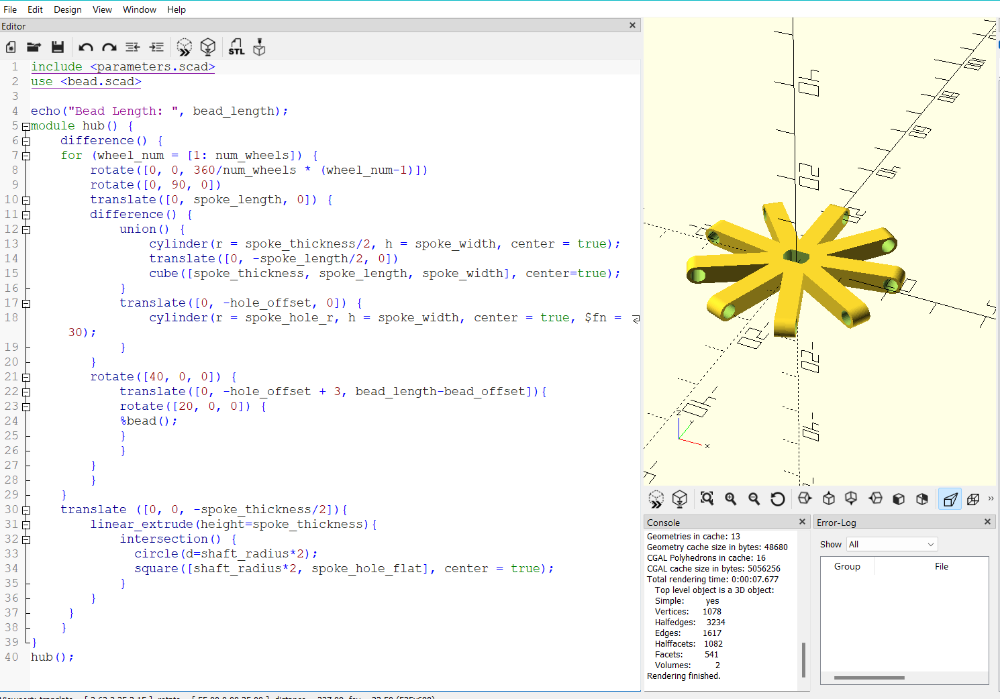

# hdrivewheelgen
Generator for H Drive Holonomic Wheels for TT Motors

## Purpose
Provide a convenient way of generating 3D printable wheels for educational robots

## How to assemble
Use a soldering iron to "weld" a piece of filament that strings together the beads of the wheel
This works decently well, but introduces too much "flex" in the wheel
